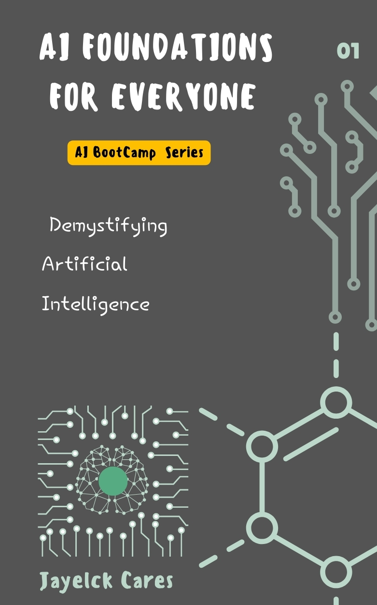
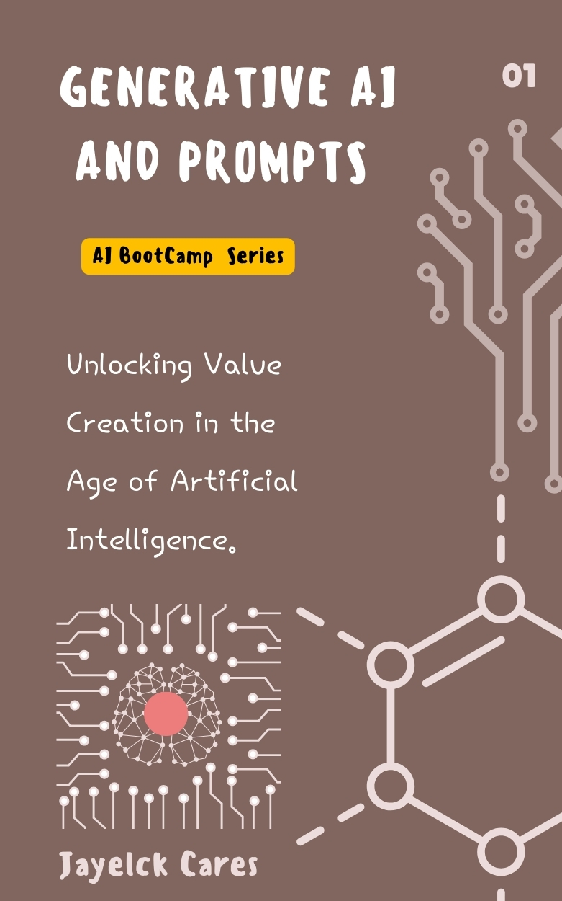
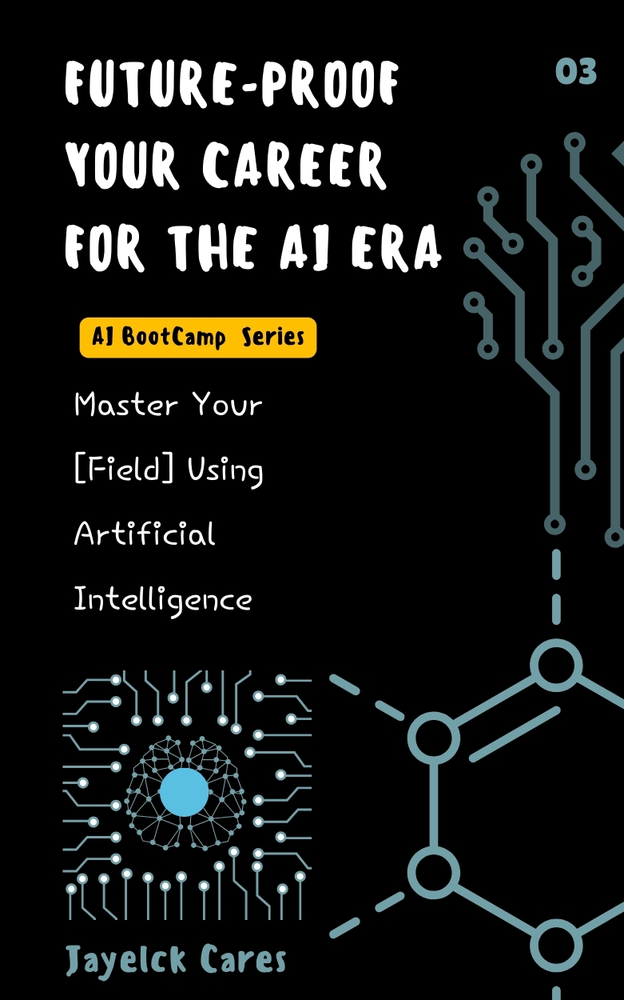

# AI Bootcamp Series

Welcome to the AI Bootcamp Series! This series includes three comprehensive books/courses designed to equip you with the knowledge and skills to leverage artificial intelligence in your professional and personal life. Whether you're a beginner or an experienced professional, these books/courses will help you stay ahead in the AI era.

## 1. AI Foundations for Everyone: Demystifying Artificial Intelligence

Start with a solid understanding of AI principles and practices. This book or course covers the basics of artificial intelligence, machine learning, and deep learning, providing a strong foundation for further exploration. Learn how AI systems work, the importance of data, and ethical considerations in AI development.

  
</img>

* [Get a Copy](https://www.amazon.com/dp/B0D84TY9BY?binding=kindle_edition&ref=dbs_dp_rwt_sb_pc_tkin) Or [Attend The Course](https://www.udemy.com/course/ai-foundations-for-everyone/?referralCode=BCC398B96E1F698980E2) 

## 2. Generative AI and Prompts: Unlocking Value Creation In the  Age of Artificial Intelligence

Dive deeper into the world of generative AI, where you'll learn about prompt engineering, creating applications with generative models, and exploring advanced AI techniques. This book will equip you with the skills to harness the creative potential of AI, enabling you to develop innovative solutions and applications.

  
</img>

* [Get a Copy](https://www.amazon.com/dp/B0D84TY9BY?binding=kindle_edition&ref=dbs_dp_rwt_sb_pc_tkin) Or [Attend The Course](https://www.udemy.com/course/generative-ai-and-prompts/?referralCode=B00F3BF28D68153A9184) 

## 3. Future-Proof Your Career: Master Your Field Using Artificial Intelligence.

Discover how AI can be a transformative tool in your profession. This book or course focuses on leveraging AI to master your field, enhance technical skills, empower foundational skills, and strengthen human-centric skills. Learn how to stay ahead of the curve and future-proof your career with AI.

  
</img>

* [Get a Copy](https://www.amazon.com/dp/B0D84TY9BY?binding=kindle_edition&ref=dbs_dp_rwt_sb_pc_tkin) Or [Attend The Course](https://www.udemy.com/course/future-proof-your-career-for-the-ai-era/?referralCode=DB2E906EFA22B8FA6D7A) 

## Resources

* [AI Engineering Tools](AI_Engineering_Tools.md)
* [Generative AI Tools](Gen_AI_Tools.md)
* [Trends](Trends.md)

## Connect with the Author

* [X or Twitter](https://twitter.com/jayelckcares)
* [Website](https://buymeacoffee.com/jayelckcares)

---

© <a href="https://github.com/jclabgit/ai_bootcamp/tree/main">JayelckCares</a>. All rights reserved.
